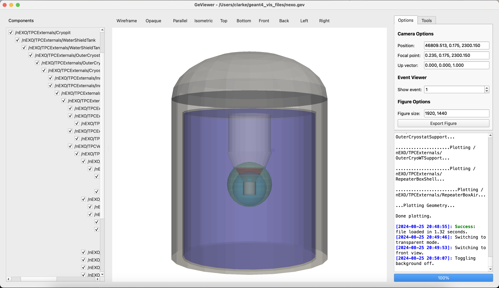

About
-----

|PyPI - Version| |GitHub Actions Workflow Status| |Read the Docs|
|GitHub last commit| |GitHub License|

GeViewer is a lightweight, Python-based visualization tool for Geant4.
It provides a convenient way to check detector geometries, view events,
and produce publication-quality visuals, without the hassle of setting
up OpenGL or installing outdated software.

Features
~~~~~~~~

-  **Physics-focused visuals:** See color-coded particle trajectories
   and hits in a 3D-rendered detector

-  **Intuitive controls:** Use your mouse to rotate, zoom, pan, and
   interact with the geomery

-  **Customizable viewing:** Adjust the viewing perspective, rendering
   style, and background for optimal visibility

-  **High-quality graphics:** Produce publication-quality visuals of
   detectors and events

-  **Robust geometry inspection:** Use simple tools to turn components
   on or off, measure distances, and check for overlaps

-  **Fast performance:** Enjoy smooth, responsive rendering even with
   large and complex detector geometries

User Interface
~~~~~~~~~~~~~~

   The GeViewer UI in light mode with transparency enabled

.. figure:: _static/sample2.png
   :alt: The GeViewer UI in dark mode with wireframe rendering enabled

   The GeViewer UI in dark mode with wireframe rendering enabled

.. |PyPI - Version| image:: https://img.shields.io/pypi/v/geviewer?logo=pypi
.. |GitHub Actions Workflow Status| image:: https://img.shields.io/github/actions/workflow/status/clarkehardy/geviewer/.github%2Fworkflows%2Fpython-package.yml?logo=GitHub
.. |Read the Docs| image:: https://img.shields.io/readthedocs/geviewer?logo=readthedocs
.. |GitHub last commit| image:: https://img.shields.io/github/last-commit/clarkehardy/geviewer?logo=GitHub
.. |GitHub License| image:: https://img.shields.io/github/license/clarkehardy/geviewer
